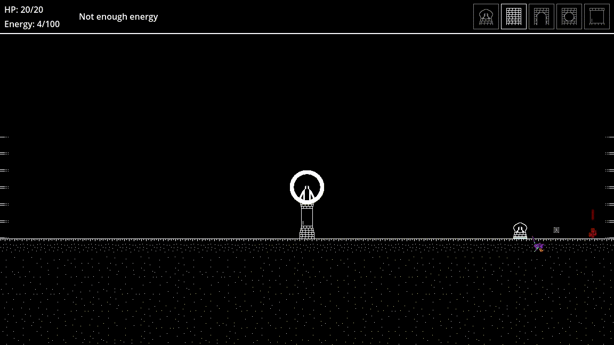
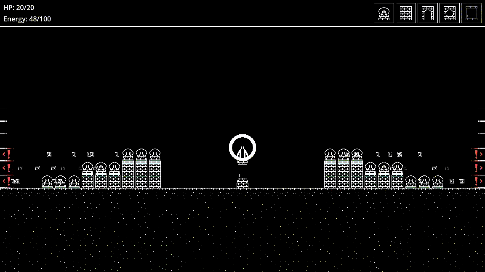

Tower defense game made with Godot.
It was created as an project for a university class.

# How to play

- Build by clicking on the toolbar and placing a building on the battlefield
- If building is destroyed those above it will collapse
- Enemies will come from both sides
- Protect the building in the middle
- Build silos to expand your Energy storage
- Get to 200 Energy to win
- You can use keyboard number row to select a building

# Gameplay

# Get the game

Download the game [here](https://github.com/kabaczek1/polarity-td-prototype/releases).
